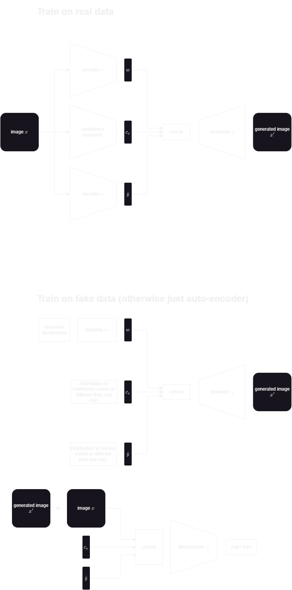

# Toy Problem

Test method on toy problem.

- [ ] data noise0.1
- [ ] check results ONERA=JZ
- [ ] results

## Data and classifier

Data is 2-dimensional and represent two moons (two classes). A noise level parameter changes the noise added to the data. We use noise=0.1 for non-overlapping data and noise=0.3 for overlapping data. \
The classifier used is linear and cannot separate correctly the two classes.

## Pipeline
Train conditional GAN and encoder. \
GAN is conditioned by class (one-hot, learned gaussian representation, or classifier prediction) and/or by classifier (true class probability, or max softmax probabality). \
The encoder encodes data into the generator input (noise, class conditioning and classifier conditioning), so it explicitely does 3 tasks: encoding data representation (in noise space), predict class (class conditioning), and predict classifier uncertainty/confidence (classifer conditioning).\
Training phases are: standard conditional GAN training, (embedding network training if gaussian class conditioning), encoder training. At some point, stop the GAN training and train only encoder (otherwise encoder always lags behing and does not converge). Encoder loss includes reconstruction (MSE of data reconstructed vs. original), reconstruction of classification (logits of reconstructed vs. original logits), additional loss for classifier conditioning (enforce confidence prediction).

## PipelineNew
Simplify code (started to get messy on pipeline.py). Two training phases: train on real data, and on fake data. Like Explaining in Style (training on fake data only mentioned in reproductibility study).\
Domain is defined using the confidence estimator (TCP like in the article). This estimator is independant from the rest of the architecture.\

### Results
Selective classification is better than the baseline (MSP of classifer). It is probably because the classifier is very bad: in that case, estimating the TCP is an improvement, but it is not necessarily the case for a better classifer: here the GAN is a better "classifier" than the classifier, which is unrealistic (if trained on the same data).

